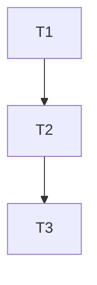

# Plan Phase — From PRD to Tracer-Bullet Plan

Produce an **implementation plan** from an approved PRD. The plan lives in `docs/plans/` and is the single source of truth for the implementation phase — every ticket, dependency, phase, and seam.

## Workflow

### 1. Gather context

Read the PRD from `docs/prd/`. If none provided, ask which PRD to plan. Load the project's skills (nestjs-best-practices, vercel-react-best-practices, ui-ux-pro-max, tdd-red-green-refactor) if the plan touches those areas.

### 2. Explore the codebase

Understand the current state enough to make good sequencing decisions:

- Where the new code must integrate (existing modules, routes, DB schema)
- What can be reused vs. built fresh
- What seams exist for testing
- What prefactoring would make the implementation easier

### 3. Identify prefactoring

Before any feature work, identify **prefactorings** — mechanical changes that widen the path for future vertical slices:

- Rename a confusing symbol
- Extract a shared type or utility
- Refactor a monolithic function into smaller ones
- Add a test seam (interface, DI token)

These become tickets that block everything else. "Make the change easy, then make the easy change."

### 4. Define vertical slices

Break the PRD's user stories and functional requirements into **tracer-bullet tickets**. Each slice:

- **Narrow but complete** — cuts through every layer (schema → API → UI → tests)
- **Demoable alone** — a finished slice is verifiable in isolation
- **Single-window-sized** — fits in one fresh context window
- **Blocking-aware** — declares what must be done before it

Each ticket has:

```
### Ticket: {short name}

**PRD refs:** FR-{N}, US-{N}
**Blocks:** {ticket names this enables}
**Blocked by:** {tickets that must finish first}

**Scope:**
- Schema: {what changes in DB}
- API: {what endpoints}
- UI: {what components}
- Tests: {what test scope}
```

### 5. Map dependency graph

Arrange all tickets with their blocking edges. Every ticket lists:

- **Blocked by** — tickets that must complete before this one starts
- **Blocks** — tickets that need this one done

A ticket with no blockers can start immediately. The graph must be acyclic. If you find a cycle, split or merge tickets until edges flow one way.

### 6. Phase & sequence

Group tickets into **delivery phases** matching the PRD's release plan:

| Phase | Tickets | Goal | Success criteria |
|-------|---------|------|------------------|
| P1 (MVP) | {list} | {what ships} | {from PRD} |
| P2 | {list} | {what ships} | {from PRD} |

Within each phase, order tickets by dependency. Prefactoring comes first.

### 7. Validate coverage

Before saving, verify:

- Every P0 user story from the PRD maps to ≥1 ticket
- Every functional requirement maps to ≥1 ticket
- Every non-functional requirement is addressed (explicitly or in ticket scope)
- All blocking edges resolve — no orphaned tickets
- Each ticket is single-window-sized

### 8. Save plan

Save as `docs/plans/plan-{feature-name}.md` (kebab-case). Structure:

```markdown
# Implementation Plan: {Feature Name}

> **PRD:** docs/prd/prd-{feature-name}.md
> **Date:** {YYYY-MM-DD}

---

## 1. Prefactoring

{list of prefactoring tickets with rationale}

## 2. Vertical Slices

### Ticket 1: {name}
...
### Ticket 2: {name}
...

## 3. Dependency Graph



## 4. Phases

| Phase | Tickets | Goal | Success Criteria |
|-------|---------|------|------------------|
| P1 | T1, T2 | {goal} | {criteria} |

## 5. Risks & Mitigations

| Risk | Impact | Likelihood | Mitigation |
|------|--------|------------|------------|

## 6. Open Questions

- {question} — {owner}

## 7. Appendix

- {references to prior art, ADRs, etc.}
```

### 9. Review with user

Present the plan to the user for review. Highlight:

- Key sequencing decisions
- Trade-offs made (e.g., deferred scope)
- Risks that need attention
- Open questions requiring input

Adjust based on feedback. Once approved, the plan is the SSOT for implementation.
