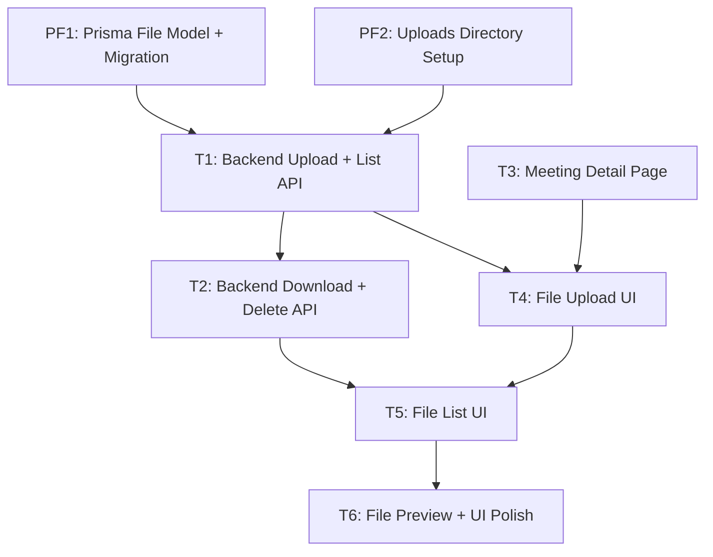

# Implementation Plan: File Upload for Meetings

> **PRD:** docs/prd/prd-file-upload.md
> **Date:** 2026-07-30

---

## 1. Prefactoring

No prefactoring needed — the codebase has all the patterns ready (JwtAuthGuard, @UserId decorator, PrismaService global module, @nestjs/platform-express with multer). The two setup items below are prerequisites, not refactorings.

**PF1: Prisma File Model + Migration**
- Add `File` model to `apps/api/prisma/schema.prisma`
- Run `npx prisma migrate dev --name add_file_model`
- Run `npx prisma generate`
- Blocks everything else

**PF2: Uploads Directory Setup**
- Create `apps/api/uploads/` directory
- Add `uploads/` to `apps/api/.gitignore`
- Add `uploads/**` to NestJS build assets in `nest-cli.json` so the dir is included in production builds
- Blocks T1

## 2. Vertical Slices

### Ticket 1: File Backend — Upload + List API

**PRD refs:** FR-1, FR-2, FR-3, FR-4, FR-5, FR-6, FR-7, FR-14, FR-15, US-1, US-2, NFR-1, NFR-2, NFR-3, NFR-4
**Blocks:** T2, T4
**Blocked by:** PF1, PF2

**Scope:**
- **Schema:** File model in Prisma (already done by PF1)
- **API:**
  - `POST /meetings/:meetingId/files` — multipart upload via `FileInterceptor('file')` from `@nestjs/platform-express`
    - Validate: file size ≤ 100 MB (multer `limits`)
    - Validate: MIME type whitelist (`audio/*`, `video/*`, `application/pdf`, `application/msword`, `application/vnd.openxmlformats-officedocument.*`)
    - Sanitize filename: strip path separators, special chars; store as `{uuid}-{sanitizedOriginalName}`
    - Store on disk: `uploads/{userId}/{meetingId}/{uuid}-{sanitizedName}`
    - Save metadata to DB: `originalName`, `mimeType`, `size`, `storagePath`, `meetingId`, `userId`
    - Ownership check: meeting must belong to requesting user (via Prisma query, reuse `findFirst` pattern from `MeetingService`)
    - Return: `{ id, originalName, mimeType, size, createdAt }`
  - `GET /meetings/:meetingId/files` — list file metadata
    - Ownership check (meeting belongs to user)
    - Return: `{ files: [{ id, originalName, mimeType, size, createdAt }] }`
  - Custom `FilesController` with class-level `@UseGuards(JwtAuthGuard)` (same pattern as MeetingsController)
  - `FilesService` with `PrismaService` injection (same pattern as MeetingService)
  - `FilesModule` importing `AuthModule` (for JWT strategy availability)
  - Register `FilesModule` in `app.module.ts`
  - Error format follows existing pattern: `{ statusCode, message, error }`
- **Files created:**
  - `apps/api/src/files/files.module.ts`
  - `apps/api/src/files/files.controller.ts`
  - `apps/api/src/files/files.service.ts`
  - `apps/api/src/files/dto/` — response DTOs (optional, can use inline types)
- **Tests:**
  - E2E (supertest): upload valid file (201), upload oversize file (400), upload bad MIME type (400), upload without auth (401), upload to another user's meeting (404), list files (200), list empty (200)
  - Unit (if service has non-trivial logic): mock PrismaService, test filename sanitisation, test MIME validation

### Ticket 2: File Backend — Download, Preview, Delete API

**PRD refs:** FR-8, FR-9, US-3, US-4, NFR-11
**Blocks:** T5
**Blocked by:** T1

**Scope:**
- **API:**
  - `GET /meetings/:meetingId/files/:fileId/download` — stream file as attachment
    - Ownership check (file → meeting → user)
    - Use NestJS `StreamableFile` — read stream from disk, set `Content-Disposition: attachment; filename="..."`
    - Handle: file not on disk → 404 with message
  - `GET /meetings/:meetingId/files/:fileId/preview` — stream file inline
    - Same as download but `Content-Disposition: inline`
    - Used by frontend for audio/video preview
  - `DELETE /meetings/:meetingId/files/:fileId` — remove from disk + DB
    - Ownership check
    - Delete from disk first, then DB (if disk delete fails, abort — don't touch DB)
    - Handle: file not in DB → 404, file on disk but not in DB → 404, disk full → 507
    - Return: `{ message: 'File deleted' }`
  - All endpoints in existing `FilesController`
- **Tests:**
  - E2E: download existing file (200, check Content-Disposition), download non-existent (404), download another user's file (404), preview (200, Content-Disposition inline), delete own file (200), delete non-existent (404), delete another user's file (404)

### Ticket 3: Meeting Detail Page

**PRD refs:** (prerequisite for file UI)
**Blocks:** T4
**Blocked by:** nothing (standalone page, no dep on backend files)

**Scope:**
- **UI:**
  - Create `apps/web/src/app/(authenticated)/meetings/[id]/page.tsx`
  - Fetch meeting by ID from `GET /meetings/:id`
  - Display: title, date (formatted), participants list
  - Add "Files" section below meeting info as a placeholder container (renders child components from T4/T5 later)
  - Loading state: `<Spinner>`
  - Error state: `role="alert"` block
  - 404 state (meeting not found): specific message
  - Client component (`'use client'`) — uses `useAuth()` for token, `useParams()` for meeting ID
- **Tests:**
  - Component tests (Vitest + RTL): loading state, renders meeting info, error state, 404 state

### Ticket 4: File Upload UI

**PRD refs:** FR-1, FR-10, US-1, US-6, NFR-5, NFR-8, NFR-9
**Blocks:** T5
**Blocked by:** T1, T3

**Scope:**
- **UI:**
  - `FileUpload` component: dropzone area (clickable) + "Upload file" button
    - Accept attribute: allowed MIME types
    - Client-side pre-validation: file size < 100 MB, allowed MIME type
    - Upload via `fetch` or `XMLHttpRequest` with progress tracking (XHR has native `upload.onprogress`)
    - Show progress: HeroUI `<Progress>` with `role="progressbar"`, `aria-valuenow`
    - Success: file appears in list (via callback to parent)
  - Error handling:
    - File too large: red inline text below dropzone
    - Unsupported type: same inline error
    - Network error: toast-style notification
  - Accessibility:
    - Upload button: `aria-label="Upload file"`
    - Dropzone: keyboard accessible, Enter/Space triggers file dialog
    - Progress bar: `role="progressbar"`, `aria-valuenow`, `aria-valuemin="0"`, `aria-valuemax="100"`
  - Loading state: spinner on upload button, progress bar during upload
- **Files created:**
  - `apps/web/src/components/file-upload/file-upload.tsx`
- **Tests:**
  - Component tests: render upload zone, simulate file selection, show validation error (size), show validation error (type), upload progress renders

### Ticket 5: File List UI

**PRD refs:** FR-7, FR-8, FR-9, US-2, US-3, US-4, NFR-6, NFR-7, NFR-10
**Blocks:** nothing (P1 complete)
**Blocked by:** T2, T4

**Scope:**
- **UI:**
  - `FileList` component: fetches file list from `GET /meetings/:meetingId/files`, renders items
  - `FileItem` component: single row with file type icon, name, size, date, action buttons
  - Action buttons:
    - Download: `GET .../download` → triggers browser download (anchor with download attribute or `window.open`/blob)
    - Delete: confirmation dialog → `DELETE ...` → remove from list
  - States:
    - Empty: icon + "No files uploaded yet" + CTA to upload (T4's dropzone)
    - Loading: skeleton rows (3 animated rectangles)
    - Error: inline error message
    - List: rows with alternating or card-style layout
  - Mobile responsive (≤ 640px): cards instead of table rows, compact icon-only action buttons with `aria-label`
  - Accessibility:
    - File list: `role="list"` with `aria-label="Meeting files"`
    - Download button: `aria-label="Download {filename}"`
    - Delete button: `aria-label="Delete {filename}"`
    - Delete confirmation: dialog with focus trap
    - All interactive elements ≥ 44×44px touch target
  - Integration with T4: FileUpload component embedded above the list
- **Files created:**
  - `apps/web/src/components/file-upload/file-list.tsx`
  - `apps/web/src/components/file-upload/file-item.tsx`
  - `apps/web/src/components/file-upload/index.ts`
  - (Optionally `file-upload.tsx` from T4 merged as `file-upload-section.tsx` parent)
- **Tests:**
  - Component tests: render empty state, render loading skeleton, render file list, click download, click delete (confirm dialog appears), confirm delete (item removed), mobile responsive (card layout)

### Ticket 6: File Preview + UI Polish

**PRD refs:** FR-11, FR-12, FR-13, US-5, US-7
**Blocks:** nothing (P2 complete)
**Blocked by:** T5

**Scope:**
- **UI:**
  - `FilePreview` component:
    - `audio/*` files: inline `<audio>` element with controls
    - `video/*` files: inline `<video>` element with controls, preload="metadata"
    - Other files: document type icon (PDF, DOC, generic)
  - File type icons: SVG icons for audio, video, PDF, document, generic file
    - Use inline SVG (no external icon library) — match project's current icon approach (Header likely uses simple elements)
  - File size formatting utility: bytes → "1.5 KB", "23 MB", etc.
  - Upload progress visual polish: HeroUI `<Progress>` component with animation
  - Accessibility audit of all file components:
    - Audio/video players: `<figure>` + `<figcaption>` with filename
    - All icons: `aria-hidden="true"` with visible text or `aria-label` on parent button
    - Keyboard nav through all file actions
- **Files created:**
  - `apps/web/src/components/file-upload/file-preview.tsx`
  - `apps/web/src/components/file-upload/file-icon.tsx`
  - `apps/web/src/lib/format-file-size.ts`
- **Tests:**
  - Component tests: render audio player for audio file, render video player for video file, render icon for PDF, size formatting function

## 3. Dependency Graph



## 4. Phases

| Phase | Tickets | Goal | Success Criteria |
|-------|---------|------|------------------|
| P1 (MVP) | PF1, PF2, T1, T2, T3, T4, T5 | Upload, list, download, delete files. Basic validation. Local storage. All P0 stories ship. | All P0 user stories pass: upload file to meeting (US-1), see file list (US-2), download file (US-3), delete file (US-4). API integration tests green. Frontend component tests green. |
| P2 | T6 | Inline audio/video preview, file type icons, size formatting, upload progress bar, accessibility polish | All P1 stories pass: preview audio/video (US-5), upload progress visible (US-6), P2 stories: file type icons + size formatting (US-7). Frontend component tests green. |

**P1 execution order:**
1. PF1 + PF2 (parallel, no deps)
2. T1 + T3 (parallel, dep on PF1+PF2 for T1; no deps for T3)
3. T2 (dep on T1)
4. T4 (dep on T1, T3)
5. T5 (dep on T2, T4)

## 5. Risks & Mitigations

| Risk | Impact | Likelihood | Mitigation |
|------|--------|------------|------------|
| Disk space exhausted during upload | High — upload fails, user loses file | Low | Handle `ENOSPC` in multer, return 507 with clear message. Monitor via NFR-11. |
| MIME type spoofing (user renames .exe to .pdf) | Medium — non-video file stored | Medium | Validate MIME from buffer magic bytes (e.g., `file-type` package), not just `Content-Type` header. Deferred to P2 if time-constrained. |
| Race condition: delete while streaming download | Low — stream fails mid-way | Low | File is already deleted from DB; download file not on disk returns 404 before streaming begins. Edge case: stream started, then file deleted → stream error caught gracefully. |
| Meeting detail page scope creep | Medium — page becomes more than just a container | Medium | Keep T3 strictly scoped: fetch meeting + render info + "Files" section placeholder. No file logic in this ticket. |
| JWT token expires during large upload | Medium — upload fails after minutes of transfer | Low | 100 MB max keeps uploads short. Detect 401 in upload callback, prompt re-login. Not in scope for P1. |
| No existing file type icon set in project | Low — adds UI dev time | Medium | Use simple inline SVG icons (file-audio, file-video, file-pdf, file-doc, file-generic). No icon library dependency added. |

## 6. Open Questions

- **Should we validate MIME type from file magic bytes (not just Content-Type header)?** — Owner: backend / Status: TBD. Would require adding a package like `file-type`. Deferred to P2 unless critical.
- **Upload progress: XHR or fetch + ReadableStream?** — Owner: frontend / Status: Decision made: use XHR for `upload.onprogress` since `fetch` streaming for upload progress has limited browser support. Revisit if project adds Axios or similar.
- **File model name collision: `File` is a global in TS/Node.js.** Prisma namespaces it, so `prisma.file.create()` is fine, but imports like `import { File } from '@prisma/client'` could shadow `globalThis.File`. — Owner: backend / Status: Acceptable risk. Prisma generates the model as a type, not a value, so no runtime collision. If it causes confusion, rename model to `MeetingFile`.

## 7. Appendix

### API URL convention

The PRD specifies `/api/v1/meetings/:meetingId/files`. The existing API uses flat paths (`/meetings`, `/auth/login`). The Next.js proxy in `next.config.js` maps the `/api/` prefix to the API: `/api/meetings/:path*` → `http://localhost:3001/meetings/:path*`. Decision: **use `/meetings/:meetingId/files`** (no v1 prefix) for consistency with the existing API, and call it from the web app via the `/api/` prefix (`/api/meetings/:meetingId/files`).

> **Why the `/api/` prefix:** the meeting detail page lives at `/meetings/[id]`, which collides with the API rewrite `/meetings/:path*` — the rewrite swallowed the page route and returned the API's 401 instead of the page. Moving the proxy under `/api/` keeps page routes (`/meetings/[id]`) free of collisions.

### Ownership model

```
User ──has──> Meeting ──has──> File
User ──has──> File (direct relation, userId)
```

Файлы хранят `userId` напрямую (relation File → User). Ownership-проверка выполняется на уровне файла: `findFirst({ where: { id: fileId, meetingId, userId } })` — файл должен принадлежать и запрошенной встрече, и запрошенному пользователю. Это закрывает и случай «чужой файл в своей встрече» (например, если fileId подменён).

### Module pattern

Files module follows the **Service pattern** (not CQRS), matching the Meetings module — the existing project convention for simple CRUD. Per CLAUDE.md: "CQRS — если операция требует валидации, проверок, побочных эффектов... Service — если операция сводится к прямому CRUD."

### Prior art
- Meeting controller/service pattern: `apps/api/src/meetings/` — controller with class-level `@UseGuards(JwtAuthGuard)`, service with `PrismaService` injection
- E2E test setup: `apps/api/test/meetings.e2e-spec.ts` — `TestingModule` with `AppModule`, auth via real JWT (the `x-user-id` header override was removed in the S1 account-takeover fix)
- Frontend component tests: `apps/web/src/app/(authenticated)/page.spec.tsx` — `vi.mock` for auth context, `vi.stubGlobal('fetch')` for API
- HeroUI patterns: compound components (`Card.Content`), `onPress` over `onClick`, `className="w-full"` on Input

### Next.js proxy note

The files API endpoints are proxied by the `/api/` rewrite rules in `next.config.js`:
```js
{ source: '/api/meetings/:path*', destination: 'http://localhost:3001/meetings/:path*' }
{ source: '/api/auth/:path*', destination: 'http://localhost:3001/auth/:path*' }
{ source: '/api/user/:path*', destination: 'http://localhost:3001/user/:path*' }
```
All web app fetches use the `/api/` prefix so they never collide with page routes (e.g. `/meetings/[id]`).
