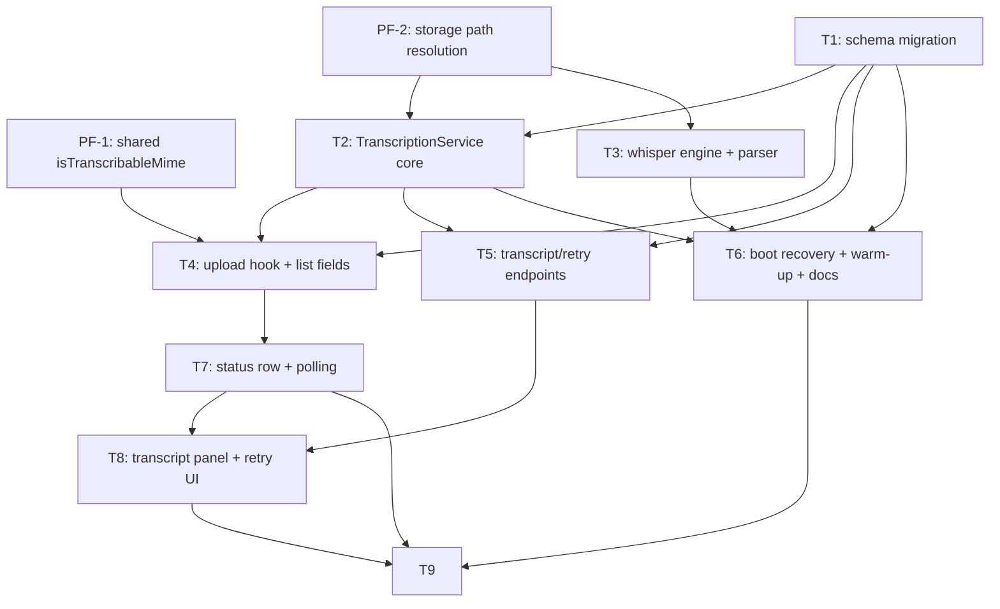

# Implementation Plan: Local Whisper Transcription

> **PRD:** docs/prd/prd-transcription.md
> **Date:** 2026-08-07
> **Status:** Draft (ожидает ревью)

---

## 1. Prefactoring

Механические изменения, которые расширяют путь для вертикальных срезов. Делаются первыми, не дают новых фич.

### PF-1: Shared-хелпер `isTranscribableMime`

**Зачем:** FR-1/FR-2 требуют различать «транскрибируемый» файл (audio/*, video/*) на бэкенде (после upload) и на фронтенде (каким файлам показывать строку статуса). Сейчас в `@meeting-ai/shared` есть `getFileKind(mime)` и префиксы `AUDIO_MIME_PREFIX`/`VIDEO_MIME_PREFIX`, но нет одного семантического предиката.

**Scope:**
- `packages/shared/src/index.ts` — добавить `isTranscribableMime(mime: string): boolean` (kind `audio` | `video`).
- `packages/shared/src/index.spec.ts` — unit-тесты (audio/video → true, pdf/doc/unknown → false).

**Blocks:** T4 (upload hook).
**Blocked by:** —.

### PF-2: Вынести разрешение пути хранения из `FilesService`

**Зачем:** `resolveStoredPath` (apps/api/src/files/files.service.ts:169) — private, а NFR-7 требует, чтобы TranscriptionService тоже резолвил пути (и входной файл, и временные wav/txt) с тем же guard'ом. Если TranscriptionModule будет импортировать FilesModule для доступа к приватному методу — возникает циклическая зависимость (FilesModule импортирует TranscriptionModule ради `enqueue`, см. T4).

**Scope:**
- Вынести логику `resolveStoredPath` + базовый `UPLOAD_DIR` в отдельный инжектируемый сервис (например `apps/api/src/files/storage-path.service.ts`, провайдер в FilesModule; токен — тот же `UPLOAD_DIR`).
- `FilesService` переходит на него. Поведение не меняется (throw `ForbiddenException('Invalid file path')` при выходе за `UPLOAD_DIR`).
- Проверить, что существующий `files.e2e-spec.ts` (кейс 403 при `storagePath: '../../../../etc/passwd'`, строка 267-283) остаётся зелёным.

**Blocks:** T2, T3.
**Blocked by:** —.

---

## 2. Vertical Slices

### Ticket T1: Схема — поля и enum транскрибации

**PRD refs:** §9 (Data Model), NFR-10
**Blocks:** T2, T4, T5, T6
**Blocked by:** —

**Scope:**
- Schema (`apps/api/prisma/schema.prisma`, модель `MeetingFile`): `enum TranscriptionStatus { PENDING PROCESSING COMPLETED FAILED }` + nullable-поля `transcriptionStatus`, `transcriptionProgress Int?`, `transcriptionError String?`, `transcript String?`, `transcriptionLanguage String?`, `transcribedAt DateTime?`, `@@index([transcriptionStatus])`.
- Миграция: `npx prisma migrate dev --name add_transcription` + `prisma generate` в `apps/api`.
- Учесть Prisma 7 с генератором `prisma-client` (output `apps/api/generated/prisma`) — enum импортируется из `'../../../generated/prisma/client'`.
- Семантика `transcriptionStatus = null` — файл не транскрибируется (обратная совместимость), документировать в коде/комментарии миграции.

### Ticket T2: TranscriptionService — очередь, жизненный цикл, seam `WHISPER_ENGINE`

**PRD refs:** FR-3, FR-4, FR-5, FR-6, FR-7, FR-15, FR-16; NFR-2, NFR-11, NFR-12
**Blocks:** T4, T5, T6
**Blocked by:** PF-2, T1

**Scope:**
- `apps/api/src/transcription/` — `transcription.module.ts`, `transcription.constants.ts`, `transcription.service.ts`.
- Определить интерфейс и токен `WHISPER_ENGINE` (аналог `MIME_TYPE_DETECTOR`):
  ```ts
  interface WhisperEngine {
    transcribe(absPath: string, opts: {
      onProgress: (pct: number) => void;
      onLanguage?: (lang: string) => void;
      signal?: AbortSignal;
    }): Promise<{ transcript: string; language?: string }>;
  }
  ```
- `TranscriptionService`: in-process FIFO-очередь (массив + `inFlight`-счётчик), лимит конкуренции из env `TRANSCRIPTION_CONCURRENCY` (дефолт 1, парсинг в constants). Метод `enqueue(fileId)`.
- Жизненный цикл задачи: `PENDING` → `PROCESSING` (перед стартом) → `COMPLETED` (сохранить `transcript`, `transcriptionLanguage`, `transcribedAt`) | `FAILED` (`transcriptionError`).
- Прогресс: `onProgress` персистит `transcriptionProgress` (0–100); не писать в БД на каждый процент без необходимости — только при изменении значения.
- Cleanup временных файлов в `finally` обработчика (NFR-11): удалить `.txt` из whisper (`.wav` убирает сам движок опцией `removeWavFileAfterTranscription`).
- FR-15 (удаление во время обработки): перед каждым критическим DB-записью пере-проверять существование строки (`findUnique`); если строка удалена — пропустить запись и завершить задачу без ошибки.
- FR-16: язык из `onLanguage` (если движок его отдал).
- Unit-тесты (`transcription.service.spec.ts`): мок `PrismaService` + стаб `WHISPER_ENGINE`; переходы статусов, конкуренция (2 задачи при лимите 1 → последовательно), ошибка движка → `FAILED` с причиной, cleanup временных файлов, удалённая строка во время задачи.

### Ticket T3: Движок — обёртка над `nodejs-whisper` + парсер прогресса

**PRD refs:** FR-5, FR-16; NFR-1, NFR-4, NFR-12; §11 (решение 1)
**Blocks:** T6
**Blocked by:** PF-2

**Scope:**
- `apps/api/src/transcription/whisper-engine.ts` — реализация `WHISPER_ENGINE` через `nodewhisper()`: путь к файлу, `modelName: 'base'`, `autoDownloadModelName` (dev), `removeWavFileAfterTranscription: true`, `-otxt`, `-l auto`. Работает дочерним процессом (не блокирует event loop). Читает `{wav}.txt` → `transcript`.
- `apps/api/src/transcription/progress.parser.ts` — парсер строк stderr `/progress\s*=\s*(\d+)\s*%/`; вызывается из logger-хука движка. Unit-тесты: валидные строки, мусор, мультилайн.
- `apps/api/package.json`: добавить `nodejs-whisper` (dependencies, `^0.3.x`); добавить npm-скрипт `whisper:download` (явное скачивание модели, см. Open Questions).
- Маппинг ошибок движка/ffmpeg/модели в стабильные английские ключи (NFR-12), напр. `'ffmpeg not found'`, `'No audio stream'`, `'Model not downloaded'` — константы в `transcription.constants.ts`.
- Смоук: при `TRANSCRIPTION_ENABLED` транскрибировать короткий тестовый mp3 вручную (не в CI).

### Ticket T4: Хук загрузки — `PENDING` + `enqueue`, поля в списке

**PRD refs:** FR-1, FR-2, FR-9; NFR-5
**Blocks:** T7
**Blocked by:** PF-1, T1, T2

**Scope:**
- API:
  - `files/files.service.ts` `upload()`: после создания записи, если `isTranscribableMime(mimeType)` → создать запись сразу с `transcriptionStatus: 'PENDING'` и вызвать `transcriptionService.enqueue(file.id)`; иначе статус `null` (FR-2). Ответ POST включает `transcriptionStatus` (+ `transcriptionProgress`).
  - `findAll()`: добавить в `select` поля `transcriptionStatus`, `transcriptionProgress`, `transcriptionError`, `transcriptionLanguage` (без `transcript` — тяжёлый).
  - `files/files.module.ts`: импортировать `TranscriptionModule`.
- Tests:
  - e2e (`transcription.e2e-spec.ts` по паттерну `files.e2e-spec.ts`): стаб `MIME_TYPE_DETECTOR` → `audio/mpeg`, стаб `WHISPER_ENGINE` (мгновенный результат). Upload mp3 → ответ со статусом `PENDING` → поллинг списка до `COMPLETED` + текст в GET transcript; upload pdf → `transcriptionStatus: null`, движок не вызван.
- Прим.: e2e-ожидание завершения очереди — поллинг GET списка с таймаутом (реалистичный флоу), не хак `flush()`.

### Ticket T5: Эндпоинты — GET transcript, POST retry

**PRD refs:** FR-8, FR-10; NFR-5
**Blocks:** T8
**Blocked by:** T1, T2

**Scope:**
- API:
  - `transcription.controller.ts` (маршруты вложены в `meetings/:meetingId/files/:fileId`): `GET …/transcript` — 200 `{ transcript, language, transcribedAt }` для `COMPLETED`; 409 `'Transcription not completed'` иначе; 404 чужой/несуществующий файл. `POST …/transcription/retry` — только для `FAILED`: 202 `{ transcriptionStatus: "PENDING" }` + `enqueue`; 400 если уже `PENDING`/`PROCESSING`; 404 чужой.
  - Ownership: переиспользовать `FilesService.findOwned` (single query = authz + existence) — конвенция 404, не 403.
- Tests:
  - e2e: 404 для чужого файла; 409 пока не `COMPLETED`; 400 при повторном retry в `PENDING`/`PROCESSING`; 202 → статус `PENDING` и задача повторно выполняется.

### Ticket T6: Boot-recovery + warm-up + env/конфиг + документация

**PRD refs:** FR-14; NFR-6, NFR-10; §11 (решения 7, 8), §13 (модель/ffmpeg)
**Blocks:** —
**Blocked by:** T1, T2, T3

**Scope:**
- `TranscriptionService.onModuleInit` (через `OnModuleInit`):
  - Boot-recovery: `updateMany({ where: { transcriptionStatus: 'PROCESSING' }, data: { transcriptionStatus: 'FAILED', transcriptionError: 'Interrupted by server restart' } })` (использует `@@index([transcriptionStatus])`).
  - Warm-up: фоновый вызов движка (инициирует cmake-сборку whisper-cli и/или скачивание модели) — не блокирует boot, ошибки логируются, задача не падает.
- Env-парсинг в `transcription.constants.ts`: `TRANSCRIPTION_ENABLED` (дефолт `true`), `TRANSCRIPTION_CONCURRENCY` (дефолт 1), `WHISPER_MODEL_DIR`, `WHISPER_MODEL_NAME` (дефолт `base`), флаг auto-download. Обновить `.env.example` в `apps/api` (NFR-6).
- Гате: если `TRANSCRIPTION_ENABLED=false` — `enqueue` no-op, эндпоинты возвращают 409/404 (зафиксировать поведение в тестах).
- Docs: раздел транскрибации в `docs/deployment.md` (установка ffmpeg, cmake/Xcode CLT, скачивание модели, env-переменные, warm-up, время первой транскрибации); обновить `## Структура` и таблицы в корневом `CLAUDE.md`, актуализировать скиллы проекта.
- Unit-тест recovery: `onModuleInit` переводит `PROCESSING` → `FAILED` (мок Prisma).

### Ticket T7: Frontend — тип, строка статуса, polling

**PRD refs:** FR-11; NFR-3, NFR-8, NFR-9; §8 (UI/UX)
**Blocks:** T8, T9
**Blocked by:** T4

**Scope:**
- UI:
  - Расширить тип `MeetingFile` в `apps/web/src/components/file-upload/file-upload.tsx`: `transcriptionStatus?: 'PENDING' | 'PROCESSING' | 'COMPLETED' | 'FAILED' | null`, `transcriptionProgress?: number | null`, `transcriptionError?: string | null`.
  - Новый `transcription-status.tsx` (в `components/file-upload/`): по статусу — бейдж «Ожидает транскрибации» (серый), `ProgressBar` HeroUI v3 + «Транскрибация… N%» (PROCESSING, `role="progressbar"` + `aria-valuenow`), «Готово» (зелёный; при наличии языка — «Готово · ru»), «Ошибка» (красный) + причина из `transcriptionError` (перевод через `translateApiError`). Бейдж: `role="status"` + `aria-live="polite"`.
  - `file-item.tsx`: рендер строки статуса под метаданными; на ≤640px строка переносится, кнопки icon-only.
  - `file-list.tsx`: polling — `useEffect` + `setInterval` 3s, пока есть файлы со статусом `PENDING`/`PROCESSING`; прекращать при отсутствии активных задач и на unmount; при сетевой ошибке сохранять последний известный статус и повторить на следующем тике (NFR-3); не перезаписывать состояние «моргающим» рендером — обновлять только при изменении данных.
- Tests:
  - Unit: `transcription-status.spec.tsx` (все 4 статуса, прогресс, пустой/ошибочный текст); `file-list.spec.tsx` — fake timers: опрос идёт при активных задачах и прекращается, когда все `COMPLETED`/`FAILED`.

### Ticket T8: Frontend — панель транскрипта, retry, переводы ошибок

**PRD refs:** FR-12, FR-13, FR-17; NFR-9, NFR-12; §8 (UI/UX)
**Blocks:** T9
**Blocked by:** T5, T7

**Scope:**
- UI:
  - Новый `transcript-panel.tsx`: кнопка «Показать транскрипт» (≥44px, `aria-expanded`/`aria-controls`, `aria-label` с именем файла); раскрывающийся блок под файлом: fetch `GET …/transcript` → спиннер (loading), текст `whitespace-pre-wrap` (готово), «Речь не распознана. Проверьте качество записи.» (пустой текст, FR-17), сообщение об ошибке внутри блока (error). Error state рядом с элементом, не только toast. Детектированный язык из ответа (`language`) показывается в шапке блока («Язык: ru») — решение product от 2026-08-07.
  - `file-item.tsx`: кнопка «Повторить» для `FAILED` (`POST …/transcription/retry`), после 202 — оптимистичный `PENDING`, дальше polling подхватывает; 400 (уже обрабатывается) — toast.
  - `apps/web/src/lib/api-errors.ts`: переводы ключей `'Transcription not completed'`, `'Interrupted by server restart'`, `'ffmpeg not found'`, `'No audio stream'`, `'Model not downloaded'` и т.п. (NFR-12).
- Tests:
  - Unit: `transcript-panel.spec.tsx` (loading/empty/error/success, клик по «Показать транскрипт»), retry-клик в `file-item.spec.tsx`.

### Ticket T9: E2E (web) — полный флоу

**PRD refs:** US-2, US-3, US-4; §12 (Testing Strategy, E2E web)
**Blocks:** —
**Blocked by:** T7, T8

**Scope:**
- Playwright (`apps/web/e2e/transcription.spec.ts`): авторизация → создание встречи → загрузка mp3 → бейдж статуса появляется → (стаб на уровне API/route: транскрипция мгновенно завершена) → открытие «Показать транскрипт» → виден текст; кейс ошибки → «Повторить» → текст.
- Для стабильности не зависеть от реальной транскрибации: мокать ответы транскрипции на уровне route (как указано в PRD §12) либо поднимать api со стабом `WHISPER_ENGINE`.

---

## 3. Dependency Graph



Ацикличен. Критический путь: `PF-2, T1 → T2 → T4 → T7 → T8 → T9`. `PF-1`, `T3`, `T5`, `T6` идут параллельными дорожками.

## 4. Phases

| Phase | Tickets | Goal | Success Criteria |
|-------|---------|------|------------------|
| P0 (Enabling) | PF-1, PF-2, T1 | Хелперы + миграция без изменения поведения | ✅ shared-тесты 18; миграция `20260807065523_add_transcription` применена; e2e files зелёные |
| P1 (Backend pipeline) | T2, T3 | Очередь с жизненным циклом + реальный движок whisper | ✅ Unit 105 (13 suites); движок собирает модель/бинарь, `-pp -l auto -otxt -ng` |
| P2 (Backend API + reliability) | T4, T5, T6 | Хук загрузки, эндпоинты, boot-recovery, warm-up, доки | ✅ e2e 102 (7 suites); PROCESSING→FAILED при рестарте; гейт `TRANSCRIPTION_ENABLED`; деплой-доки актуальны |
| P3 (Frontend) | T7, T8 | Статус/прогресс (+ язык в бейдже), панель транскрипта (+ язык в шапке), retry, переводы | ✅ web-тесты 154 (24 files); aria-атрибуты, 44px-кнопки, polling 3s останавливается |
| P4 (E2E) | T9 | Сквозной флоу в браузере | ✅ Playwright 5 e2e (все зелёные); флоу на стабе транскрипции через `page.route` |

Все фазы = P1 (MVP) релизного плана PRD. P2 (сегменты, язык в UI, BullMQ) — вне скоупа.

## 5. Risks & Mitigations

| Risk | Impact | Likelihood | Mitigation |
|------|--------|------------|------------|
| API `nodejs-whisper` отличается от документации PRD (версия `^0.3`, сигнатура `nodewhisper`) | Высокий | Средняя | В T3 — до написания движка проверить фактическую сигнатуру установленного пакета, зафиксировать в `whisper-engine.ts` и адаптировать интерфейс из T2 |
| Первая транскрибация долгая (cmake-сборка whisper-cli, скачивание модели ~74 MB) — пользователь ждёт | Средний | Высокая | Warm-up в `onModuleInit` (T6) + явный `npm run whisper:download` и шаг сборки в деплой-доке; сообщение в UI при первом запуске |
| ffmpeg/cmake отсутствуют на машине разработчика/сервере | Средний | Средняя | Проверка на старте задачи → `FAILED` с понятным ключом `'ffmpeg not found'`; документация установки в `docs/deployment.md` |
| Циклическая зависимость FilesModule ↔ TranscriptionModule | Высокий | Низкая (если PF-2 сделан) | PF-2 выносит резолв пути из FilesService; TranscriptionModule не импортирует FilesModule |
| Файл удалён во время обработки | Средний | Низкая | Пере-проверка строки в БД перед каждым критическим write (T2); удаление диска-первым не роняет задачу |
| Временные `.wav`/`.txt` в `uploads/` (утечка, нарушение NFR-7/NFR-11) | Средний | Средняя | Cleanup в `finally` (T2); `removeWavFileAfterTranscription: true`; `txt` удаляем сами; пути резолвятся только через storage-сервис (PF-2) |
| Очередь in-process теряется при рестарте | Средний | Высокая | Boot-recovery `PROCESSING → FAILED` (T6) + кнопка «Повторить» в UI |
| CPU-нагрузка при конкуренции > 1 | Низкий | Средняя | `TRANSCRIPTION_CONCURRENCY` (дефолт 1), документировать в env |
| e2e flaky из-за асинхронной очереди | Средний | Средняя | Стаб движка резолвится мгновенно; поллинг списка с таймаутом вместо сна |
| Prisma 7 (`prisma-client` генератор) — enum и путь импорта | Средний | Низкая | T1 фиксирует импорт из `generated/prisma/client`; проверить после `prisma generate` |

## 6. Open Questions

Решённые (2026-08-07):

- **Сборка whisper-cli при первом запуске** — решено: warm-up в рантайме (`onModuleInit`, T6) + явный шаг сборки в `docs/deployment.md`. Owner: backend.
- **Скачивание модели** — решено: `autoDownloadModelName: true` в dev; для prod — явный `npm run whisper:download`. Owner: backend.
- **Отображение детектированного языка** — решено: показывать. Язык в списке файлов (`transcriptionLanguage` в T4) → бейдж «Готово · ru» (T7) и шапка панели «Язык: ru» (T8). Owner: product.

Оставшийся вопрос:

- **Фактическая сигнатура `nodewhisper()`** в `nodejs-whisper@0.3.x` (logger, опции `-otxt`, прогресс в stderr) — подтвердить в начале T3 и при необходимости скорректировать интерфейс `WHISPER_ENGINE`. Owner: backend.

## 7. Appendix

- Prior art:
  - `apps/api/src/files/` — паттерн инжектируемого детектора `MIME_TYPE_DETECTOR`, `UPLOAD_DIR`, `multerDiskOptions`, `requireOwnedMeeting`.
  - `apps/api/test/files.e2e-spec.ts` — паттерн e2e: override `MULTER_MODULE_OPTIONS`/`UPLOAD_DIR`/детектора, `mkdtempSync`, ownership → 404, path-traversal → 403.
  - `apps/web/src/components/file-upload/` — `MeetingFile` тип, XHR-загрузка с прогрессом, `FilePreview`, состояния загрузки/ошибки.
  - `apps/web/src/lib/api-errors.ts` — конвенция «стабильные английские ключи → русский перевод».
- Зависимости (runtime): `nodejs-whisper@^0.3`; системные: `ffmpeg`, cmake + C/C++ toolchain (Xcode CLT), модель `ggml-base.bin`.
- Docs-обновления при имплементации: `docs/deployment.md` (раздел транскрибации), `CLAUDE.md` (`## Структура`, таблица скриптов — новый `whisper:download`), скиллы проекта (место новой фичи).
- Решения PRD, принятые как финальные: in-process очередь (NG7), `WHISPER_ENGINE`-seam для тестов (§12), текст в строке файла 1:1 (§9), дефолт `TRANSCRIPTION_CONCURRENCY=1`, 404 для чужого ресурса (конвенция репозитория).
- Решение product (2026-08-07), расширяющее PRD §15: детектированный язык показывается пользователю (бейдж «Готово · ru» + шапка панели).
