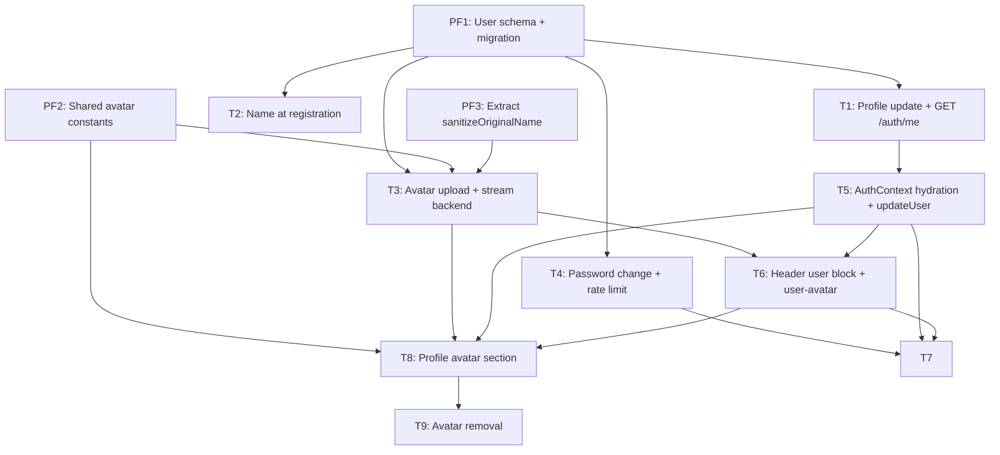

# Implementation Plan: User Profile

> **PRD:** docs/prd/prd-user-profile.md
> **Date:** 2026-08-01

---

## 1. Prefactoring

Three items unblock the feature. PF1 is a schema prerequisite (nothing backend works without it); PF2 and PF3 are small mechanical "widen the path" changes so the avatar code doesn't duplicate existing patterns.

**PF1: User schema — `name` + `avatarStoragePath` + migration**
- Add `name String?` and `avatarStoragePath String?` to `User` in `apps/api/prisma/schema.prisma`
- Run `npx prisma migrate dev --name add_user_name_and_avatar`, then `npx prisma generate`
- Blocks: T1, T2, T3, T4, T9 (everything backend)

**PF2: Shared avatar constants in `@meeting-ai/shared`**
- Add to `packages/shared/src/index.ts`:
  - `MAX_AVATAR_SIZE = 5 * 1024 * 1024`
  - `ALLOWED_AVATAR_MIME_TYPES: readonly string[] = ['image/jpeg', 'image/png', 'image/webp']`
  - `AVATAR_ACCEPT_ATTR` (join of allowed types, for frontend `accept`)
- Blocks: T3 (multer limits/filter), T8 (client-side pre-validation)

**PF3: Extract `sanitizeOriginalName` to `common`**
- Move `apps/api/src/files/file-name.util.ts` → `apps/api/src/common/utils/file-name.util.ts`
- Update imports in `files/upload.options.ts` (and any spec); re-export from `files/file-name.util.ts` is NOT needed if we update the single importer
- No behavior change. Avatar storage must reuse the same sanitizer (PRD FR-13), and `user` importing from `files` is a smell.
- Blocks: T3

## 2. Vertical Slices

### Ticket 1: Backend — profile update (name/email) + `GET /auth/me`

**PRD refs:** FR-1, FR-2, FR-3, US-1, US-2, US-5, NFR-3
**Blocks:** T5
**Blocked by:** PF1

**Scope:**
- **Schema:** none (PF1 done)
- **API:**
  - `PATCH /user/profile` — extend `UpdateUserProfileCommand` to carry `name?` and `email?`; new `dto/update-user-profile.dto.ts` (`name`: IsString + IsOptional + MaxLength(50) + not-empty check via `@Matches(/.*\S.*/)`; `email`: IsEmail + IsOptional)
  - `UserService.updateProfile`: trim `name` before persisting (decided 2026-08-01, Open Questions), load user, if `email` changed → check uniqueness (409 `ConflictException('Email already exists')`), else skip; return `{ id, email, name, hasAvatar }`
  - `UserService.getProfile` + `GetUserProfileQuery` → return `{ id, email, name, hasAvatar }` (`hasAvatar = avatarStoragePath !== null`)
  - `GET /auth/me` — new `GetMeQuery` + handler in `auth/queries/` (PrismaService direct, like register/login), route with `@UseGuards(JwtAuthGuard)`, returns same profile shape
- **Files created:** `apps/api/src/user/dto/update-user-profile.dto.ts`, `apps/api/src/auth/queries/get-me.query.ts`, `apps/api/src/auth/queries/get-me.handler.ts`
- **Tests:**
  - Unit (UserService, mock Prisma): update name, update email unchanged (no uniqueness check), update email to taken → 409, getProfile returns `hasAvatar`
  - Unit (handlers): command → service mapping
  - E2E: PATCH profile (name), PATCH profile email → 409 when taken, GET /auth/me (200 with name/hasAvatar, 401 without token)

### Ticket 2: Backend — optional `name` at registration

**PRD refs:** FR-14, US-8
**Blocks:** —
**Blocked by:** PF1

**Scope:**
- **API:**
  - `RegisterDto`: add optional `name` (IsString + IsOptional + MaxLength(50))
  - `RegisterCommand`: add optional `name`
  - `register.handler.ts`: trim `name` (decided 2026-08-01) and persist on create
- **Tests:**
  - E2E: register with name (200, name persisted via GET /user/profile), register without name (still works)
  - Unit: register.handler.spec — passes name to prisma.create

### Ticket 3: Backend — avatar upload + stream (replace deletes old)

**PRD refs:** FR-4, FR-5, FR-6, FR-13, NFR-1, NFR-2, NFR-3, NFR-4, NFR-11
**Blocks:** T6, T8
**Blocked by:** PF1, PF2, PF3

**Scope:**
- **API:**
  - `POST /user/profile/avatar` — `FileInterceptor('file')` with avatar-specific `diskStorage` options: destination `uploads/{userId}/avatar`, filename `${randomUUID()}-${sanitizeOriginalName(...)}`, `limits.fileSize = MAX_AVATAR_SIZE`, `fileFilter` on `ALLOWED_AVATAR_MIME_TYPES`
  - `UserService.uploadAvatar(file, userId)`: save `avatarStoragePath = join(userId, 'avatar', basename(file.path))`, then unlink old `avatarStoragePath` from disk (log-and-continue on failure — NFR-11); return `{ id, email, name, hasAvatar: true }`
  - `GET /user/profile/avatar` — `StreamableFile` with `Content-Type` set from detected MIME (reuse `file-type` magic-byte detection, already a dependency) + `@Header('X-Content-Type-Options', 'nosniff')`; 404 when no avatar or file missing on disk
  - Path-traversal protection: reuse the `resolve` + prefix-check pattern from `FilesService.resolveStoredPath`
  - `UserModule` adds `MulterModule.registerAsync` (same `UPLOAD_DIR` resolution as FilesModule)
- **Files created:** `apps/api/src/user/avatar-upload.options.ts` (or `user/upload.options.ts`)
- **Tests:**
  - Unit (UserService, mock Prisma + mock fs): uploadAvatar persists path, unlink old file logged on failure, no old file → no error
  - E2E: upload jpeg (200, hasAvatar true), upload png/webp (200), upload > 5 MB (400), upload wrong MIME (400), upload without file (400), GET avatar (200 + content-type, 404 without avatar, 401 without token), replace avatar deletes old (assert old file gone)

### Ticket 4: Backend — password change + rate limiting

**PRD refs:** FR-7, FR-15, NFR-5, NFR-13
**Blocks:** T7
**Blocked by:** PF1

**Scope:**
- **API:**
  - Add dependency: `@nestjs/throttler` (pin v6.x — compatible with Nest 10)
  - Register `ThrottlerModule` in `AppModule` with env-configurable limit (default 5 req / 15 min), `ThrottlerGuard` as `APP_GUARD` or applied per-route; storage: in-memory (decided 2026-08-01, Open Questions)
  - `PATCH /user/password` — `dto/change-password.dto.ts` (`password`: IsString + MinLength(6)); `UserService.changePassword(userId, password)` → bcrypt.hash (10 rounds) + prisma.update; never return the hash
  - Apply throttling only to the password route (per-route `@Throttle` or `@UseGuards(ThrottlerGuard)` on the handler) so profile/avatar are unaffected
- **Files created:** `apps/api/src/user/dto/change-password.dto.ts`, `apps/api/src/user/commands/change-password.command.ts`, `apps/api/src/user/commands/change-password.handler.ts`
- **Tests:**
  - Unit (UserService): changePassword hashes via bcrypt (mock bcrypt), updates user
  - E2E: PATCH password (200), short password (400), no auth (401), throttled after N attempts (429)

### Ticket 5: Frontend — AuthContext hydration + `updateUser`

**PRD refs:** FR-12, US-5, NFR-12
**Blocks:** T6, T7, T8
**Blocked by:** T1

**Scope:**
- **UI/state:**
  - Extend `User` interface in `contexts/auth-context.tsx` with `name: string | null` and `hasAvatar: boolean`
  - On mount (token present): hydrate fresh profile via `GET /api/auth/me` (JWT) and set user
  - Add `updateUser(partial)` → merges into state + localStorage `user`
  - Add `avatarVersion` counter bumped on avatar upload/remove (forces `user-avatar` blob refetch)
  - Login flow keeps working (can reuse hydration path)
- **Tests:**
  - Unit: auth-context hydration fetch on mount with token, updateUser merges state + localStorage, avatarVersion bump

### Ticket 6: Frontend — `user-avatar` component + header user block

**PRD refs:** FR-8, FR-9, FR-10, US-5, US-7, NFR-6, NFR-7, NFR-8, NFR-12
**Blocks:** T7, T8
**Blocked by:** T3, T5

**Scope:**
- **UI:**
  - New `components/user-avatar.tsx` — reusable round avatar (96 px prop-sized, used in header + profile): if `hasAvatar`, fetch blob via `GET /api/user/profile/avatar` with JWT + `URL.createObjectURL` (pattern from `file-preview.tsx`), keyed on `avatarVersion`; else initials fallback (first letters of `name`, or first char of `email`); `` with `alt={name}`
  - Rework `components/header.tsx` — replace bare email with a clickable user block: `user-avatar` (small) + name (or email if no name) + email; block is a link/button (`useRouter().push('/profile')`), ≥ 44×44, keyboard accessible, `aria-label`
- **Files created:** `apps/web/src/components/user-avatar.tsx`
- **Tests:**
  - Unit (header.spec): renders avatar/initials fallback, renders name + email, missing name → shows email, click block → router.push('/profile'), logout still works
  - Unit (user-avatar): initials from name, initials from email, blob fetch when hasAvatar

### Ticket 7: Frontend — profile page (General + Password sections)

**PRD refs:** FR-1, FR-2, FR-7, FR-12, US-1, US-2, US-4, NFR-6..NFR-10
**Blocks:** —
**Blocked by:** T4, T5, T6

**Scope:**
- **UI:**
  - New `app/(authenticated)/profile/page.tsx` — client component, three stacked HeroUI `Card` sections: Avatar (rendered by T8, placeholder in this ticket), General, Password
  - General section: name + email inputs, heroUI `<Form className="w-full">`, inputs `w-full`, `autoComplete` (`name`, `email`); on submit → `PATCH /api/user/profile` → `updateUser()`; success toast; inline `role="alert"` errors (email taken 409, invalid email, empty/too-long name); loading: skeleton on page load, disabled button + spinner on save
  - Password section: new + confirm password fields (`new-password` autocomplete), client-side match check, on submit → `PATCH /api/user/password`; inline errors (short password, mismatch), success toast, network errors via toast
  - Empty states: name empty → show email
- **Files created:** `apps/web/src/app/(authenticated)/profile/page.tsx`, `apps/web/src/components/profile/general-section.tsx`, `apps/web/src/components/profile/password-section.tsx`
- **Tests:**
  - Unit: renders sections, submit general form calls PATCH + updateUser, 409 → inline email error, short/mismatched password inline errors, success toast

### Ticket 8: Frontend — profile page Avatar section (upload + replace)

**PRD refs:** FR-4, FR-5, FR-8, FR-12, US-3, NFR-6, NFR-7, NFR-8, NFR-9, NFR-12
**Blocks:** T9
**Blocked by:** T3, T5, T6

**Scope:**
- **UI:**
  - `components/profile/avatar-section.tsx`: round preview (`user-avatar`, 96 px), «Загрузить аватар» button wrapping a keyboard-accessible file input (`accept` from shared `AVATAR_ACCEPT_ATTR`), spinner on preview while uploading
  - Client-side pre-validation (size ≤ `MAX_AVATAR_SIZE`, MIME in `ALLOWED_AVATAR_MIME_TYPES`), inline `role="alert"` error
  - On success: `updateUser({ hasAvatar: true })` + bump `avatarVersion` + toast; inline errors for 400
  - Remove button intentionally deferred to T9 (P2)
- **Files created:** `apps/web/src/components/profile/avatar-section.tsx`
- **Tests:**
  - Unit: renders initials fallback, file too large → inline error, valid upload → POST called + updateUser + version bump, upload spinner/disabled state

### Ticket 9: Backend + Frontend — remove avatar (DELETE + button)

**PRD refs:** FR-11, US-6, NFR-6, NFR-7
**Blocks:** — (P2 complete)
**Blocked by:** T3, T8

**Scope:**
- **API:**
  - `DELETE /user/profile/avatar` — `UserService.removeAvatar(userId)`: unlink from disk (ENOENT tolerated), clear `avatarStoragePath`, return `{ message: 'Avatar deleted' }`
  - Reuses the disk-removal helper introduced in T3
- **UI:**
  - Add «Удалить» button to `avatar-section.tsx` (confirmed in place or via dialog), `aria-label="Удалить аватар"`, ≥ 44×44; on success `updateUser({ hasAvatar: false })` + bump `avatarVersion`
- **Tests:**
  - E2E: DELETE avatar (200), file gone from disk + hasAvatar false, GET avatar → 404 after delete
  - Unit: delete button calls DELETE + updates context

## 3. Dependency Graph



## 4. Phases

| Phase | Tickets | Goal | Success Criteria |
|-------|---------|------|------------------|
| P1 (MVP) | PF1, PF2, PF3, T1, T2, T3, T4, T5, T6, T7, T8 | Edit name/email, change password + rate limit, upload/replace + stream avatar, header user block → `/profile`, profile page, name at registration | All P0 stories (US-1..5) + P1 stories US-7 (click header → /profile) and US-8 (name at registration) pass. API + web unit tests green. |
| P2 | T9 | Remove avatar | US-6 passes. E2E (api + web) green. |

**P1 execution order:**
1. PF1, PF2, PF3 (parallel)
2. T1, T2 (parallel, after PF1) — T3, T4 (parallel, after PF1-3)
3. T5 (after T1)
4. T6 (after T3, T5) — T4 already → T7 can start after T4 + T5 + T6
5. T7 (after T4, T5, T6), T8 (after T3, T5, T6) — parallel
6. T9 (after T8) — P2

## 5. Risks & Mitigations

| Risk | Impact | Likelihood | Mitigation |
|------|--------|------------|------------|
| `@nestjs/throttler` version incompatibility with Nest 10 | Build failure | Low | Pin v6.x; verify install in T4 before coding. |
| Stale avatar in header after upload (cached blob URL) | UI shows old avatar | Medium | `avatarVersion` in AuthContext bumped on upload/remove; `user-avatar` re-fetches on version change. |
| Multer file-size/MIME errors surface as 413/plain errors, not PRD's 400 format | Inconsistent errors, inline validation can't match | Medium | Map `PayloadTooLargeException`/multer errors in UserModule; keep fileFilter `BadRequestException` for MIME (consistent with FilesModule). |
| JWT email becomes stale after email change | Stale claims in token | Low | Display data comes from AuthContext (hydrated via `/auth/me`), never from token payload; token `sub` unchanged. Documented non-goal (NG2, no email re-verification). |
| Rate limit (5/15 min) breaks e2e password tests | Flaky tests | Medium | Limit configurable via env (`THROTTLE_TTL`/`THROTTLE_LIMIT`), set high in test env; `@Throttle` override on route. |
| Existing header.spec mocks `user` without `name`/`hasAvatar` | Header tests break | Medium | `user-avatar` and header fall back safely when fields are absent; update mocks in T6. |
| Avatar `Content-Type` not stored in schema (PRD has no `avatarMimeType`) | Wrong content-type on GET | Medium | Detect magic bytes with existing `file-type` dependency at serve time; no schema change. Flagged in Open Questions. |

## 6. Open Questions

- **S3/облачное хранение аватаров?** — Owner: backend / Status: TBD (эта итерация — локальная ФС, как files). — PRD §15.
- **Content-Type для GET avatar:** решено — детект magic-bytes через `file-type` на лету (без изменения схемы). Owner: backend / Date: 2026-08-01.
- **`@nestjs/throttler` storage:** решено — in-memory (одна инстанция; DB при горизонтальном масштабировании). Owner: backend / Date: 2026-08-01.
- **Trim имени:** решено — trim перед валидацией/сохранением; имя из одних пробелов → 400. Owner: backend / Date: 2026-08-01.

## 7. Appendix

### API contract summary (from PRD §10)

| Method | Endpoint | Request | Response |
|--------|----------|---------|----------|
| GET | `/auth/me` | — | `{ id, email, name, hasAvatar }` |
| GET | `/user/profile` | — | `{ id, email, name, hasAvatar }` |
| PATCH | `/user/profile` | `{ name?, email? }` | `{ id, email, name, hasAvatar }` |
| POST | `/user/profile/avatar` | multipart `file` | `{ id, email, name, hasAvatar: true }` |
| GET | `/user/profile/avatar` | — | Binary stream |
| DELETE | `/user/profile/avatar` | — | `{ message: 'Avatar deleted' }` |
| PATCH | `/user/password` | `{ password }` | `{ message: 'Password updated' }` |

### Storage layout

```
uploads/{userId}/avatar/{uuid}-{sanitizedName}
```
- DB stores only the relative path in `User.avatarStoragePath`
- Reuses `UPLOAD_DIR` resolution from FilesModule (`process.env.UPLOAD_DIR ?? uploads/`)
- Reuses `resolveStoredPath`-style traversal protection + `sanitizeOriginalName` (moved to `common` by PF3)

### Module decisions

- **CQRS:** profile/password go through CommandBus/QueryBus (consistent with existing UserModule). Avatar upload/stream are Service methods called directly from `UserController` (multer + streaming are controller concerns; no extra CQRS ceremony).
- **Multer:** `MulterModule.registerAsync` in `UserModule` with avatar-specific `diskStorage` options (PRD FR-4/FR-5). Separate from FilesModule's multer because destination/filter differ.
- **`GET /auth/me`:** lives in AuthModule (new query, direct PrismaService — same as register/login), returns the same shape as `GET /user/profile` for context hydration.

### Prior art

- Storage + streaming: `apps/api/src/files/files.service.ts` (resolveStoredPath, StreamableFile, log-and-continue unlink)
- Filename sanitization: `apps/api/src/files/file-name.util.ts` (moved to `common` by PF3)
- Blob fetch with JWT: `apps/web/src/components/file-upload/file-preview.tsx`
- Header tests with mocked `useAuth`: `apps/web/src/components/header.spec.tsx`
- Form tests with HeroUI: `apps/web/src/app/login/page.spec.tsx`
- E2E auth override: `apps/api/test/auth.e2e-spec.ts` (register → token → Bearer header)

### Seams

- `PrismaService` — mock point for all DB operations
- `AuthContext.updateUser` / `avatarVersion` — tested via context mock (header.spec pattern)
- Multer — mocked via `@nestjs/testing` / supertest multipart uploads
- `file-type` (already in deps) — MIME detection for GET avatar content-type
